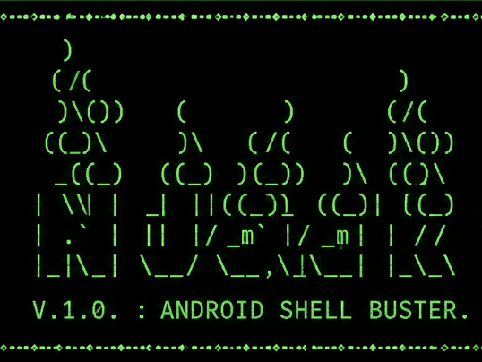

═══════════════════════════════════════════════════════════════
                      NJack v1.0
               Android Shell Buster
═══════════════════════════════════════════════════════════════

  

<h1 align="center">🔥 NJack 🔥</h1>

Android Shell Buster • A Python-based ADB CLI Toolkit

---

Author(s)
---------
• Cyberstar2023
• InfoyTech

Description
-----------
NJack is a Python-based Android shell utility / pen-testing tool that communicates
with Android devices through the Android Debug Bridge (ADB).

The tool provides a simple command-line interface to interact
with an Android device after the user has paired and connected
it using Android Wireless Debugging.

Supported Platforms
-------------------
✔ Windows
✔ Linux
✔ Termux (Android)

Termux / Linux Installation
---------------------------
    git clone https://github.com/Cyberstar2023/NJack-v.1.0

Change Directory
----------------

    cd NJack-v.1.0

Python Requirement
------------------
Python 3.10 or above is recommended.

Python Package
--------------
Install the required dependency:

    pip3 install termcolor

Linux / Termux Requirements
---------------------------
Update packages:

    pkg update && pkg upgrade

Install Android Platform Tools:

    pkg install android-tools

Windows Requirements
--------------------
No external ADB installation is required.

The project folder already contains the official ADB repository
provided by InfoyTech.

Simply extract the project and run the Python script.

Features
--------
• Wireless ADB Pairing
• Wireless Device Connection
• Device Information
    - Device Name
    - Model
    - Android Version
    - Battery Status

• Device Management
    - Disconnect unwanted ADB devices
    - Exit and cleanly stop ADB server

Available Operations
--------------------
1. Capture Screenshot
2. Return to Home Screen
3. Launch Applications
4. Stop Applications
5. Type Text
6. Tap Anywhere on Screen
7. Initiate Phone Call
8. Disconnect & Exit

Usage
-----
Windows:

    python NJack.py

Linux:

    python3 NJack.py

Termux:

    python3 NJack.py

Connection Steps
----------------
1. Enable Developer Options.
2. Enable Wireless Debugging.
3. Obtain the device IP Address.
4. Obtain the Pairing Port.
5. Pair the device.
6. Obtain the Debugging Port.
7. Connect to the device.
8. Select the desired operation from the menu.

Required Permissions
--------------------
The Android device must have:

• Developer Options enabled
• Wireless Debugging enabled
• Authorization accepted on the device

Notes
-----
• Only authorized devices can be controlled.
• If multiple ADB devices are connected, disconnect the unwanted
  device before continuing.
• Keep both devices connected to the same local network.

Project Information
-------------------
Version : v1.0

Name    : NJack
Subtitle: Android Shell Buster

Developed by
-------------
Cyberstar2023
InfoyTech

=========================================================
This software is intended for educational, testing,
development, and authorized device management purposes only.
Use only on devices you own or are explicitly authorized
to administer. Unauthorized access to devices may violate
laws and policies.

Copyright © 2026 Cyberstar2023 & InfoyTech
All Rights Reserved.
=========================================================
